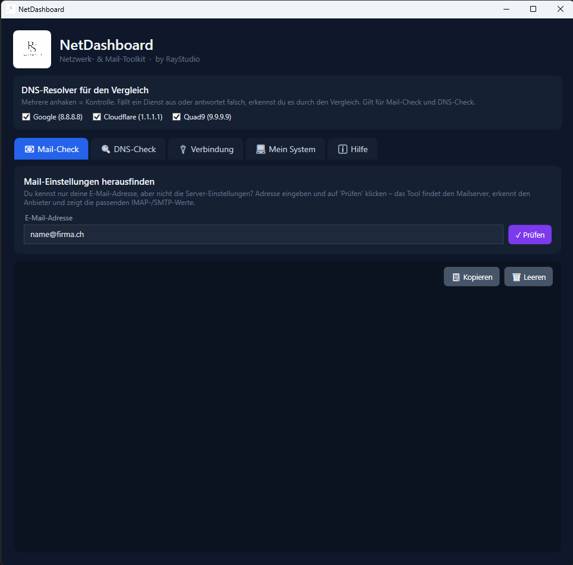

<div align="center">
  
  <h1>NetDashboard</h1>
</div>

[🇬🇧 English Version](README.md)

**Netzwerk- & Mail-Toolkit für Windows; C# · WPF · .NET 8**

NetDashboard ist ein kompaktes Windows-Werkzeug, das DNS-Abfragen, E-Mail-Server-Erkennung, Netzwerkdiagnose und Systeminformationen in einer einzigen Dark-Theme-Oberfläche vereint; mit vollständiger dreisprachiger UI.

Konzipiert für M365-verbundene Infrastrukturen. Validiert DNS- und Exchange Online-Konnektivitätsanforderungen gemäss den [Microsoft 365 Netzwerk-Konnektivitätsprinzipien](https://learn.microsoft.com/de-de/microsoft-365/enterprise/microsoft-365-network-connectivity-principles).

[](https://github.com/9t29zhmwdh-coder/NetDashboard/actions)      [](https://github.com/9t29zhmwdh-coder/NetDashboard/releases) [](LICENSE)

> **So läuft das:** NetDashboard ist eine native Windows-Desktop-App (WPF), kein Server und kein Browser-Tool. Sie öffnet ihr eigenes Fenster wie jedes installierte Programm. Aktuell gibt es keinen fertigen Installer: du baust die App aus dem Quellcode mit dem .NET 8 SDK, siehe Erste Schritte unten.



---

> 🌱 Neu hier? → [Schritt-für-Schritt-Anleitung für Einsteiger](GETTING_STARTED.de.md)

---

**In der Praxis:** Du bekommst ein einzelnes Dark-Theme-Fenster, das in wenigen Klicks beantwortet, warum eine Domain keine Mails senden oder empfangen kann: Adresse einfügen, Mailserver ermitteln, und DNS, SPF, DKIM und DMARC gleichzeitig über drei öffentliche Resolver querprüfen.

## Funktionen

| Tab | Funktion |
|-----|----------|
| **Mail-Check** | E-Mail-Adresse eingeben → IMAP- & SMTP-Server automatisch per DNS ermitteln |
| **DNS-Check** | Abfragen für A, AAAA, MX, TXT, NS, CNAME, SOA, PTR und ALL , parallel über bis zu 3 Resolver |
| **Verbindung** | Ping, Port-Test und Traceroute zu beliebigen Hosts |
| **Mein System** | IP-Konfiguration, DNS-Server, DNS-Cache anzeigen/leeren, ARP-Tabelle, Routing-Tabelle, öffentliche IP |

**DNS-Resolver** wählbar: Google (8.8.8.8) · Cloudflare (1.1.1.1) · Quad9 (9.9.9.9)

---

## Microsoft 365 / Exchange Online Anwendungsfälle

NetDashboard ist besonders nützlich in Microsoft 365- und Exchange Online-Umgebungen:

| Szenario | Vorgehensweise |
|----------|----------------|
| **M365-Mail-Setup prüfen** | MX-Record für `deinedomain.ch` abfragen ; Exchange Online-Routing bestätigen |
| **SPF / DKIM / DMARC Audit** | TXT-Record-Abfrage zeigt SPF-Policy, DKIM-Selektoren und DMARC-Enforcement |
| **Autodiscover-Validierung** | CNAME `autodiscover.deinedomain.ch` → `autodiscover.outlook.com` prüfen |
| **Teams / SIP SRV-Records** | DNS-Check → ALL für Teams Direct Routing SRV-Records |
| **MX-Priorität prüfen** | MX-Prioritätsreihenfolge für hybrides Exchange-Routing verifizieren |
| **Spam-Filter-Bypass** | Alle TXT-Records prüfen : Drittanbieter-Filter in SPF enthalten? |
| **Connector-Fehlerbehebung** | SMTP-Banner und Port-Verfügbarkeit zu Exchange Online IPs testen |

---

## Sprachen / Languages / Langues

Die Sprache ist direkt in der App umschaltbar, kein Neustart nötig.

🇩🇪 Deutsch &nbsp;|&nbsp; 🇬🇧 English &nbsp;|&nbsp; 🇫🇷 Français

---

## Voraussetzungen

- Windows 10 / 11
- [.NET 8.0 Runtime](https://dotnet.microsoft.com/download/dotnet/8.0)

---

## Erste Schritte

```bash
# Build aus dem Quellcode
dotnet build NetDashboard.csproj --configuration Release

# Ausführen
dotnet run --project NetDashboard.csproj
```

---

## Deinstallation / Datenbereinigung

Lösche den Build-Ordner (`bin/`, `obj/`), oder entferne die installierte Kopie über Windows-Einstellungen → Apps, falls du sie selbst verpackt hast. NetDashboard schreibt nicht in die Registry und hat keine gespeicherten Einstellungen: nach dem Schliessen bleibt nichts zurück.

---

## Technologien

- **Sprache:** C# 12
- **Framework:** WPF / .NET 8
- **UI:** Dark-Theme, MVVM-Muster
- **DNS:** System.Net.Dns + roher UDP-Resolver
- **Keine externen Abhängigkeiten**: vollständig offline nach dem Start

---

**Autor:** [Rafael Yilmaz](https://github.com/9t29zhmwdh-coder) · **Status:** Active ·  · **Lizenz:** MIT
